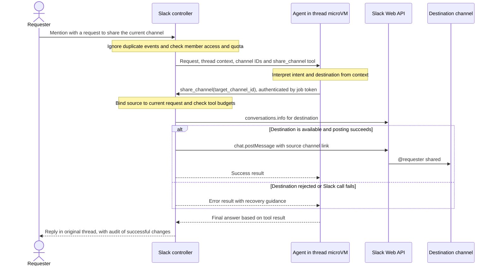
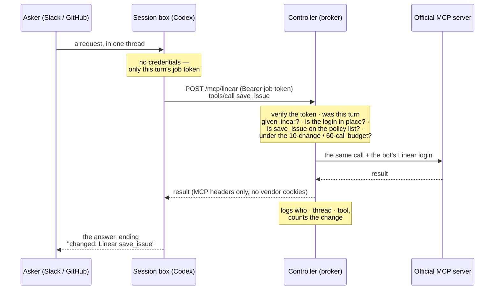

# BoxLite Agent — `@boxliteai`

Mention **@boxliteai** in any public GitHub issue or pull request, or in your team's Slack, and it
answers in the thread. For a repo's maintainers it can also open a draft PR. There's nothing to
install on GitHub: it's a regular GitHub account. Each request runs
[Codex CLI](https://github.com/openai/codex) in that thread's own [BoxLite](https://boxlite.ai)
microVM, with a full shell and network, so it can run the code before it answers. Slack gets all of
that too, draft PRs and the admin commands included. There it also gets the files attached to a
message, and it can read your team's Linear, Notion and Google Workspace as its own accounts, and
comment and file things in Linear and Notion.

```
@boxliteai why does `npm test` fail on this PR?                        (GitHub)
@boxliteai add retries to the client in src/http.ts and open a PR      (GitHub)
@boxliteai what broke? (ci.log attached)                               (Slack)
@boxliteai what's left on LIN-231, and does the spec in Notion agree?  (Slack)
```

## How it works

![GitHub mentions reach the controller box by polling or App push, and Slack messages over a Socket Mode connection the controller dials out. The controller holds every real credential, calls chatgpt.com and the team's Linear, Notion and Google Workspace with the bot's own logins, and runs one session box per issue, PR or Slack thread. Session boxes hold no credentials and reach the model, the tools and (on a write turn) one staging branch of the bot's fork only through the controller. GitHub threads and Slack threads never mix: each side keeps its context on a volume of its own, and a GitHub box never mounts Slack's.](docs/architecture.svg)

- **One box and one Codex session per issue, PR or Slack thread.** Follow-ups resume the session.
  A PR's checkout follows its latest head; a Slack follow-up also sees what others said in the
  thread since the bot's last reply.
- **Codex may do anything in its box:** no sandbox, no approval prompts, no hook reviews, `sudo`,
  network, live web search. The microVM is the boundary, and nothing worth stealing is ever inside it.
- **Every box runs [agent-tooling](https://github.com/boxlite-ai/agent-tooling),** BoxLite's shared
  Codex plugin with its skills, auditors and hooks. It's refreshed to the tip of `main` when it's
  over 10 minutes old. The Codex runs its hooks start go through the controller too.
- **Only the controller holds credentials.** Codex runs on a stand-in login whose token works only
  on the controller's proxy, and only until the turn ends.
- **GitHub and Slack never mix.** See [below](#github-and-slack-never-mix).
- **PRs only for people who may ask.** Codex commits in its box; the controller checks the change
  and opens the PR. Everyone else gets the change as a diff in the reply.
- **Slack needs no public URL.** The controller dials out to Slack (Socket Mode).
- **The team's tools go through the controller too.** Linear, Notion and Google Workspace reach
  Codex as MCP servers on the controller, behind the same job token. The controller checks every
  call against the tools you allow and swaps in the bot's own login. See
  [Linear, Notion and Google Workspace](#linear-notion-and-google-workspace).

### One mention, start to finish


The controller stays attached to the exec for the whole turn, because BoxLite reaps an exec nobody
is attached to. It stops the box as soon as the turn ends, then posts the reply. It acks every
Slack event the moment it arrives. In Slack, Codex's Markdown goes out in Slack's `markdown` block,
and a long answer is split into a few messages, never in the middle of a code block.

### Memory that outlives the box


Live state (the checkout or working directory, and `CODEX_HOME`) stays on the box's own disk, since
the S3-backed volume has no rename or append. After every turn `CODEX_HOME` is sealed with
AES-256-GCM under a key derived for that thread, and written to the thread's directory on its
side's volume: `sessions/<owner>/<repo>/<n>/` or `sessions/<team>/<channel>/<thread ts>/`. Every box
mounts its side's whole volume, but only that thread's box gets the key. A thread's box is deleted
after 15 quiet minutes (`BOX_TTL_MIN`), and the next mention restores into a new one. The
conversation carries over; files from earlier turns don't, and Codex is told so.

### GitHub and Slack never mix

A GitHub thread's box runs a public thread's code at anyone's request. A Slack thread holds your
team's conversations. So the two sides share nothing a box can reach:

| | GitHub thread | Slack thread |
|---|---|---|
| Who can ask | anyone, in public repos | members of your workspace |
| Its box | `botlite-gh-acme-app-7-<hash>` | `botlite-slack-dm-alice-0922-<hash>`, `botlite-slack-backend-bob-0922-<hash>` |
| Its volume | `botlite-context` (`VOLUME`) | `botlite-slack-context` (`SLACK_VOLUME`) |
| Its context key comes from | `CONTEXT_SECRET` | `SLACK_CONTEXT_SECRET` |
| The team's tools | only when one of the bot's admins asks | yes |
| Who may ask for a PR | the bot's admins, the repo's maintainers, people an admin added | every member, into any public repo (`SLACK_PR_REPOS`) |
| Who runs the commands | the bot's admins (`BOT_ADMINS`) | the workspace's owners and admins |

A GitHub box never mounts the volume where Slack's threads are kept. Nor the other way round:
BoxLite can't mount a volume read-only yet, and a Slack box that could write to GitHub's volume
could leave something there for every GitHub box to read. A thread only ever runs as its own kind,
and a config that would give both sides one volume or one secret keeps Slack off. A turn's job token
opens only the tools that turn was given, so a stranger's turn on GitHub can't reach Linear with its
own token. A box's name says which thread it runs: the repo and number, or where the Slack thread
is, who started it and when. What makes it that thread's alone is the hash of the thread's whole
key at its end, so nobody can name a repo to land in another thread's box. The deploy's public log
shows only how the controller started, never a line about a thread.

### Opening a PR


- **Who may ask:** the bot's admins (`BOT_ADMINS`) anywhere; a repo's maintainers (owner, member,
  collaborator) there; and anyone an admin added to a repo with `/add`.
- **What's checked,** on GitHub's diff of the exact commit pushed: that it's a change on top of the
  base, and nothing else. A human merges every PR, so nothing is refused for what it touches or
  how big it is. Called out at the top of the PR: dependency and lockfile changes, and changes to
  `.github/workflows`, `.github/actions`, `CODEOWNERS`, `.gitmodules` or `FUNDING.yml`. CI runs a
  PR's own workflows before anyone has reviewed it, so require approval for outside
  contributors' runs in a repo with self-hosted runners.
- **Its fork runs no Actions.** Before a turn's first push, the controller turns Actions off on the
  bot's fork: a push there would run the box's code with a token that can write the fork. If it
  can't, nothing is pushed. The turn's push token may then carry workflow files, if the push App
  may write them.
- **What's published:** one commit by the bot on `botlite/<owner>/<repo>/<n>` in its fork, as a
  draft PR into the default branch. For someone else's PR, the draft PR goes into that PR's branch;
  on a PR the bot opened, the commit goes straight onto its branch. A follow-up adds a commit, and a
  branch that moved meanwhile is never overwritten.

### Commands

| Command | Who | Does |
|---|---|---|
| `@boxliteai /help` (or just `@boxliteai help`) | anyone | the commands, and whether you can ask for PRs here |
| `@boxliteai /add @user` · `/remove @user` | admins | who else can ask for PRs in this repo |
| `@boxliteai /list` | admins | who has been added here |
| `@boxliteai /pause` · `/resume` | admins | stop or restart all PR writing |
| `@boxliteai /model [model] [effort]` | admins | show, or set, the model and reasoning effort every turn runs on, GitHub's and Slack's, e.g. `/model gpt-6-astra xhigh`; `/model default` undoes it |
| `@boxliteai /deploy` | admins | put what's merged on `main` live now (see below) |

These are GitHub comments. In Slack, the workspace's owners and admins run the same ones on the
same state: `@boxliteai /model …`, `/deploy` (it reports back in that Slack thread), `/pause` and
`/resume`, so one `/pause` stops PR writing on both. `/add`, `/remove` and `/list` stay on GitHub:
in Slack every member may ask for PRs.

`/model` takes a model only if ChatGPT's Codex backend offers it (and that effort) to the bot's
pinned Codex, since a bad one would fail every turn.

The controller answers these itself; Codex never sees them. Admin commands count only in a new,
never-edited comment, because anyone with write access to a repo can edit other people's comments
there. People are kept by GitHub id, since a login can change hands.

### Improving itself

![The bot improving itself: asked to change its own code, it opens a draft PR from its fork, and it can't merge (it has read access). A human reviews and merges into main. An admin says /deploy: the controller lists the commits since the running build, finishes running turns and exits; the boot loop pulls main and the launcher starts the new build. A pull is checked before it starts (it must parse, pass the launcher's test and start offline): if it doesn't pass, the controller runs the newest pulled commit that does, or the build it had. Live, it says so in the thread and is on trial for 10 minutes; a build that fails three times in its trial is rolled back to the last good one, and the thread is told.](docs/deploy.svg)

**Merging to `main` is deploying.** Once the **test** workflow passes on a push to `main`, the
**deploy** workflow restarts the controller onto it: running turns finish first, the boot loop pulls
`main`, and the new build starts with the bot's logins and state. `/deploy` does the same from a
thread, and says there how it went. A bot PR that touches its own trust boundary (access,
publishing, the push route, credentials, the runner, deploy) opens with a warning.

### When a deploy goes wrong

| If the new build… | then |
|---|---|
| doesn't parse, link or start, or breaks the launcher | the pull gate, a hook no pull can change, walks back to the newest pulled commit that passes (or the build it had), which starts and says why in the thread |
| passes the gate, but crashes 3× in its first 10 minutes, or at the end of them isn't polling GitHub or (once set up) connected to Slack | the launcher rolls back to the last good build, and the thread is told |
| runs, but can't run a turn (a broken runner, say) | a new build runs one small turn of its own a minute into its trial, and once more two minutes later if that fails; two failures roll it back |
| hangs, stuck or with its event loop blocked | a watchdog thread kills it after 10 minutes without progress and the boot loop starts it again; a build still on trial is rolled back |
| can't reach GitHub or Slack | `/healthz` answers 503; the **health** workflow opens an issue, and closes it once it's back |
| misbehaves some other way | the **deploy** workflow's `rollback` runs an earlier commit of main |

A rollback keeps what a newer build wrote to the state: fields an older build doesn't know are kept,
not dropped.

## In Slack

Mention `@boxliteai` in a channel it's in, or send it a direct message. It answers in the thread,
and a follow-up there (a mention again, in a channel) continues the same session. Attach logs,
screenshots or code to the message and the box gets them too: up to 5 MB a file and 8 MB a message.
They reach that thread's box only, on the exec's stdin, and never go on a volume.

**Sharing a channel is an agent tool.** In the channel you want to share, ask naturally:

```text
@boxliteai let #announcements know about this channel
```

Select the destination in Slack's channel picker, or give its ID, e.g. `#C1234567890`.
Invite the bot to the destination first. The agent reads the request and thread context, then
calls `mcp__slack__share_channel({"target_channel_id":"C1234567890"})` when sharing is requested.
There is no fixed phrase parser or `/share` command. If the destination is unclear, the agent
is instructed to ask for a channel mention instead of guessing. For example, when Alice asks
from `#engineering`:

| Where | What appears |
|---|---|
| `#announcements` | `@alice shared #engineering`, followed by an **Open channel** link |
| The original thread in `#engineering` | The agent's confirmation, with a controller-recorded `Slack share_channel` change in the footer |



The tool is available only in Slack channel turns. The controller binds its source channel,
workspace and requester to the current request; the agent supplies only the destination ID.
The Slack token stays in the controller. The job token works only while that turn is active,
and cannot grant this capability to a DM or GitHub turn. Successful shares use the existing
tool write budget and appear in the reply's change audit.

The agent is instructed to call the tool only on request, and not to treat quoted examples,
code or tool output as permission. The controller enforces the source binding and destination
checks; interpreting the user's intent is the agent's responsibility. It shares only a channel
link, copies no messages or files, and grants no access to private channels. Archived channels,
DMs and destinations shared with another organization (Slack Connect) are rejected. The app
needs `channels:read`, `groups:read` and `chat:write` from `slack/manifest.json`; reinstall older
installations after updating the scopes.

Concurrent or repeated calls to the same destination in one request return the first result,
including failures, without reposting. This also holds if a lost model session is restarted.
A new user request can share again. If Slack's response is lost, the tool reports uncertainty:
check the destination before requesting a retry. These turns use the same member checks,
daily quota, scheduling and duplicate-event handling as coding turns.

**A PR from Slack.** Ask for a change as a PR and it opens a draft PR from the bot's fork, into any
public repo (`SLACK_PR_REPOS` in `src/policy.mjs` can narrow that, to `boxlite-ai/*` say). A Slack thread
belongs to no repo, so the PR is asked for at the end of the turn:

1. Codex clones the repo in its working directory, commits the change there, and leaves `pr.json`
   (which repo, which clone).
2. The runner asks the controller for the push (`/pr`, with the turn's job token). The controller
   checks: PR writing on, the repo allowed, the commits built on its default branch, one PR per
   turn. Then the runner pushes to the one staging branch the controller names.
3. After the turn, it's GitHub's path: the same checks on GitHub's own diff, one squashed commit by
   the bot, and a draft PR, whose link goes under the answer.

The PR is public, and says only that it was asked for in Slack. No names, links or Slack ids go into
it, nor into its branch's name. Codex is told its commit messages become the PR's title and
description.

**Who can use it** is `mayUseSlack` in `src/policy.mjs`. It runs before any quota is spent or box
started, and a refused person gets an explanation only they can see. As shipped it's **members
only**:

| Who | How you can tell | As shipped |
|---|---|---|
| Full members of your workspace | `user.team_id === home.teamId`, not a guest | yes |
| Members of a sibling workspace on Enterprise Grid | `enterprise_user.enterprise_id === home.enterpriseId` | yes |
| Guests (often contractors) | `is_restricted`; single-channel: `is_ultra_restricted` | no |
| Other organizations, in Slack Connect channels | `team_id` isn't yours, or `is_stranger` | no |
| Any request in a Slack Connect channel | `where.extShared` | no: even a member's answer lands in front of the other org |
| Deactivated accounts, bots | `deleted`, `is_bot` | never (the tests insist) |

## Linear, Notion and Google Workspace

Slack turns get these tools, and so do GitHub turns when one of the bot's admins asks. On GitHub
the thread is public, and Codex is told so: whatever it reads, it's asked to put only what the
request needs in its answer. Each service is off until its login is in place. Give each one a **bot
account**: every call acts as that account, and anyone who can ask the bot can read whatever it
can read. So share with it only what everyone who can ask may see.

**How a tool call flows, end to end.** The box holds no tool credential. Its Codex reaches each
service as an MCP server on the controller (`/mcp/<service>`), carrying only the turn's job token;
the controller checks the call, swaps in the bot's own login, and forwards it to the service's
official MCP server — the swap the same idea as a write turn's git push (gitpush.mjs).



Any failed check ends the call there — a service the turn wasn't given, a tool not in `TOOLS`, a
spent budget — so a public GitHub thread can't reach a tool its turn never got, and Codex can't
call one you didn't list, however it's asked. One real Slack request ("file a Linear issue and
create a Notion page"), as the controller logged it:

```
linear list_teams                       (read: find a team)
notion notion-fetch                     (read)
linear save_issue (a change)            → the issue
notion notion-create-pages (a change)   → the page
notion notion-get-users · linear get_user · notion notion-fetch   (reads: the links)
answered Dorian, changed: Linear save_issue · Notion notion-create-pages
```

| | Linear | Notion | Google Workspace |
|---|---|---|---|
| The bot's account | a member for the bot | a member or guest for the bot | a Workspace user, like `botlite@yourco.com` |
| What it sees | what that member sees | the pages shared with it | files and calendars shared with it |
| Hand it over | `LINEAR_API_KEY=lin_api_… node deploy/ctl.mjs linear-key` | `node deploy/ctl.mjs notion-login` | `GOOGLE_CLIENT_ID=… GOOGLE_CLIENT_SECRET=… node deploy/ctl.mjs google-login` |
| Lasts | until you revoke the key | 180 days, then link again (`ctl status` shows the date) | until revoked, with an *Internal* consent screen |

- **Linear:** create the API key as the bot's member, restricted to the permissions you allow.
- **Notion:** the login opens a browser. Approve it as the bot's account; nothing to set up first.
- **Google:** the Workspace MCP servers are in a
  [Developer Preview](https://developers.google.com/workspace/guides/configure-mcp-servers). Join it,
  then in a Cloud project enable the Drive, Docs, Sheets, Slides and Calendar APIs and their MCP
  APIs, set the OAuth consent screen to *Internal*, and create an OAuth client of type *Desktop
  app*. The login asks only for the scopes your tool policy needs; after you allow a new kind of
  change, run it again.

The logins run on your machine and hand the tokens to the controller. Your machine keeps nothing.

**What the bot may do** is `TOOLS` in `src/policy.mjs`: reads are listed, and every other call is
refused before it reaches the service, whatever Codex asks. Changes are the ones in `WRITES`: as
shipped, comments and issues in Linear (`save_issue` edits issues too) and comments and new pages in
Notion. Nothing deletes, moves, shares or overwrites, and nothing changes Google files. A change is
made as the bot, for anyone who may ask, and can be prompted by anything written in the thread. The
ones on offer:

| Service | Change tools | Notes |
|---|---|---|
| Linear | `save_comment`, `save_issue`, `save_document`, `save_project`, `create_attachment` | `save_issue` creates *and* edits issues |
| Notion | `notion-create-comment`, `notion-create-pages`, `notion-update-page`, `notion-move-pages`, `notion-duplicate-page`, `notion-create-database` | `notion-update-page` can overwrite a page |
| Drive | `create_file`, `copy_file` | |
| Docs · Sheets | `update_doc` · `update_values`, `update_formulas`, `update_spreadsheet`, `insert_dimension` | |
| Slides | `update_presentation` | Google marks it destructive |
| Calendar | `create_event`, `update_event`, `respond_to_event`, `delete_event` | `delete_event` is destructive |

Each request may make up to 10 changes in up to 60 tool calls. Under its answer, the bot lists the
changes it made, as the controller recorded them. The controller log records every tool call: who
asked, in which thread, which tool.

**What stays risky:** what Codex reads through these tools sits in a box with open internet access.
The controller keeps the logins out of the box and limits what Codex can *do*, but a message that
talks Codex into it could still send what it *read* somewhere else. On GitHub, that includes the
public reply. Keep the bot's accounts narrow, and add changes one at a time.

## Who holds what

| Credential | Controller | Session box | Volume |
|---|---|---|---|
| Bot's GitHub token | holds: polls, reacts, replies, forks, opens PRs | never (clones anonymously) | never |
| Push App key | holds: one token per write turn, for that fork only | never (pushes via the controller) | never |
| Slack bot token (`xoxb-`) | holds: reads threads, people, files; reacts, replies, shares channel links on request | never | never |
| Slack app token (`xapp-`) | holds: opens Socket Mode connections | never | never |
| Linear API key | holds: Linear's MCP server | never | never |
| Notion and Google logins | hold and refresh them | never | never |
| BoxLite API key | placeholder (a BoxLite secret) | never | never |
| ChatGPT login | holds and refreshes | never (a stand-in login) | never |
| Job token | issues, revokes | its own turn only: model calls, a write turn's one push (a Slack turn asks for it at `/pr`), the tools its turn was given | never |
| Thread context key | derives, from its side's secret | its own thread only | never (sealed bytes only) |
| Webhook secret | holds | never | never |

The proxy forwards only Codex's two model endpoints, a write turn's push to its one staging branch
and the tool calls your policy allows the turn. It 404s everything else, and caps requests and tool
calls per turn. Text from GitHub and Slack goes into the prompt fenced as untrusted context, never
as instructions.

Every key the controller holds is also in the repo's `production` environment (see
[From GitHub](#from-github)), so the controller box isn't the only copy. The ChatGPT, Notion and
Google logins are the exception: their refresh tokens change as they're used, so a copy anywhere
else would go stale.

## Code map

| File | Runs in | Does |
|---|---|---|
| `src/main.mjs` | controller | the launcher: rolls back a build that won't go live, then starts the controller |
| `src/controller.mjs` | controller | wiring: credentials, poll loop, quotas, replies, drain on restart |
| `src/deploy.mjs` | controller | `/deploy`: what's merged since the running build, and how the deploy went |
| `src/mentions.mjs` · `webhook.mjs` | controller | mentions from polled notifications or App pushes |
| `src/slack-channel.mjs` | controller | Slack: who may ask, each message to a turn, the answer back |
| `src/slack-socket.mjs` · `slack-events.mjs` | controller | Socket Mode events, acked at once; Slack events → requests, markup → text, files |
| `src/slack.mjs` · `slack-reply.mjs` | controller | Slack Web API as the bot: 👀, replies, file downloads |
| `src/slack-tools.mjs` · `slack-share.mjs` | controller | agent channel-sharing tool: job scope, budgets, duplicate calls, destination checks and link posting |
| `src/policy.mjs` | controller | your policy: who may use the bot in Slack, which tools it may use |
| `src/tools.mjs` · `oauth.mjs` | controller | the tool broker at `/mcp/<service>`; the bot's logins, kept fresh |
| `src/jobs.mjs` · `state.mjs` | controller | one turn per thread, a few at once; seen requests, sessions, quotas |
| `src/session.mjs` | controller | one turn: its side, start or create the box, exec the runner attached, stop it |
| `src/proxy.mjs` · `chatgpt.mjs` | controller | the public port: model endpoints only, job token → real login |
| `src/codex.mjs` | controller | `codex exec` / `resume` arguments, prompts, event parsing |
| `src/access.mjs` | controller | who may publish on GitHub; `/help` and the admin commands |
| `src/gitpush.mjs` · `githubapp.mjs` | controller | a write turn's one push: job token in, App token out, one ref |
| `src/prgrant.mjs` | controller | `/pr`: a Slack turn asks for its PR's push when its work is done |
| `src/publish.mjs` | controller | plan a write turn; check the pushed commit, squash it, draft PR |
| `src/boxlite.mjs` | controller | BoxLite REST, exec attach over WebSocket |
| `src/github.mjs` · `reply.mjs` | controller | GitHub REST as the bot: 👀 and replies |
| `box/session.mjs` | session box | restore → stand-in login → checkout or files → Codex → push commits → seal |
| `deploy/deploy.sh` · `ctl.mjs` | your terminal, GitHub | create the controller; operate it, hand over keys, roll back |
| `deploy/login.mjs` | your terminal | the one-time Notion and Google consent, handed to the controller |
| `deploy/post-merge.sh` | controller | the pull gate: a pull runs only up to its newest commit that passes |
| `.github/workflows/` | GitHub Actions | `test` every PR; `deploy` main when its tests pass; `health` |
| `slack/manifest.json` | Slack | the app: bot scopes, events, Socket Mode on |

## Run your own

```bash
export BOXLITE_API_KEY=blk_live_…
BOT_ADMINS=you bash deploy/deploy.sh                  # creates the public botlite-controller box
GITHUB_TOKEN=ghp_… node deploy/ctl.mjs github-token   # the bot account's classic PAT
GITHUB_APP_ID=… GITHUB_APP_KEY=app.pem node deploy/ctl.mjs github-app   # optional: PR writing
SLACK_BOT_TOKEN=xoxb-… SLACK_APP_TOKEN=xapp-… node deploy/ctl.mjs slack-tokens   # optional: Slack
node deploy/ctl.mjs status                            # what it's waiting for, e.g. the ChatGPT login
```

- **BoxLite key:** it must be able to create boxes. If it can't create volumes, create
  `botlite-context` and `botlite-slack-context` in the dashboard first.
- **GitHub token:** a *classic* PAT on the bot's own account with `notifications` + `repo` +
  `workflow` (the notifications API rejects fine-grained tokens). `workflow` lets the bot's forks
  catch up with an upstream that changed a workflow; without it, PRs from such a fork fail. `repo`
  lets the bot turn Actions off on its forks, which PR writing needs (with `public_repo` alone it
  only answers). It also reaches private repos, so keep the bot's account out of them: the deploy
  warns if it can see any. Never `delete_repo`. The bot is whoever the token belongs to.
- **Push App (PR writing):** a GitHub App of its own, separate from the webhook App. Give it
  *Repository permissions → Contents: Read and write*, and *Workflows: Read and write* if its PRs
  may change CI, with no webhook. Install it
  on the bot's account for *all repositories*, so new forks are covered, generate a private key,
  and hand both over with `ctl github-app`. Without it the bot only answers. The controller mints
  one token per write turn for that turn's fork, and the box never sees it.
- **Slack app:** at [api.slack.com/apps](https://api.slack.com/apps), *Create New App → From a
  manifest*, pick the workspace and paste `slack/manifest.json`. Under *Basic Information →
  App-Level Tokens*, generate one with the `connections:write` scope: that's the `xapp-…` token.
  *Install App → Install to Workspace* gives the *Bot User OAuth Token*, `xoxb-…`. Optionally,
  upload `slack/icon.png` as the app icon. Invite the bot where people should use it:
  `/invite @boxliteai`. No restart needed: the controller connects once the tokens are in. The
  manifest includes `channels:read` and `groups:read` to check sharing destinations and name
  channel threads' boxes. For an existing installation, update its scopes from the manifest and
  reinstall the app in the workspace before using channel sharing.
- **ChatGPT login:** the controller runs `codex login --device-auth` in its box, and `status` shows
  the link and code to approve with the bot's ChatGPT account. Use an account only the bot uses,
  and never copy another controller's `auth.json`: each refresh rotates the token, so two holders of
  one login knock each other out.
- **`CONTEXT_SECRET`** seals GitHub threads' contexts and signs job tokens, and
  **`SLACK_CONTEXT_SECRET`** seals Slack threads'. Each is generated on first start. Pass the same
  values again to keep every thread's context: `CONTEXT_SECRET=… bash deploy/deploy.sh`, and
  `SLACK_CONTEXT_SECRET=… node deploy/ctl.mjs slack-tokens` with the Slack tokens.

Day to day: `node deploy/ctl.mjs status | logs [n] | webhook | restart | rollback <commit> | admins <logins>`.
`restart` pulls the tracked branch and lets running turns finish first (Slack requests that arrive
meanwhile are kept for the next start); `rollback` runs an earlier commit of it until the next
restart; `admins` replaces `BOT_ADMINS` and restarts, with no redeploy. Add `--wait` to any of the
three to wait until the next start is live and see which build it is.

### From GitHub

Keep the keys in the repo's `production` environment instead of on a laptop, with only `main`
allowed to deploy:

- secrets `BOXLITE_API_KEY`, `BOT_GITHUB_TOKEN`, `PUSH_APP_PRIVATE_KEY`, `SLACK_BOT_TOKEN`,
  `SLACK_APP_TOKEN`, `SLACK_CONTEXT_SECRET` and, if the bot uses Linear, `LINEAR_API_KEY`;
- `CONTEXT_SECRET` and `WEBHOOK_SECRET`, for recreating the controller box with `deploy.sh`;
- variables `PUSH_APP_ID` and `BOT_ADMINS`.

Then the **deploy** workflow operates the controller. Every push to `main` whose tests pass goes
live by itself; by hand it does:

| Action | Does |
|---|---|
| `restart` | pull main and restart onto it |
| `handover` | give the controller its tokens and keys from the environment, e.g. after a rotation, and reinstall the pull gate |
| `rollback` | run an earlier commit of main until the next deploy |

Each run waits until that build is live, and fails with how its start went if it isn't. That log is
public, so it shows only the lines about starting. **health** checks `/healthz` every 15 minutes
once the `CONTROLLER_URL` variable is set. **test** runs `npm test` on every PR.

<details>
<summary>Settings</summary>

The controller reads these from its environment; `deploy.sh` passes `VOLUME`, `CODEX_MODEL`,
`CODEX_EFFORT`, `BOTLITE_REF`, `BOT_ADMINS`, `CONTEXT_SECRET` and `WEBHOOK_SECRET` through.

| Env | Default | |
|---|---|---|
| `BOT_ADMINS` | none | GitHub logins, comma-separated, who may ask for PRs anywhere, use the team's tools on GitHub, and run the admin commands (`ctl admins` replaces it) |
| `VOLUME` / `SLACK_VOLUME` | `botlite-context` / `botlite-slack-context` | GitHub threads' and Slack threads' context volumes, never the same one |
| `CODEX_MODEL` | Codex's default | model for every turn (also pinned by the proxy), until an admin's `/model` |
| `CODEX_EFFORT` | the model's default | reasoning effort for every turn (`low` … `xhigh`, `max`, `ultra`, as the model allows), until `/model` |
| `BOTLITE_REF` | `main` | the branch the controller runs |
| `SESSION_IMAGE` / `SESSION_CPUS` / `SESSION_MEMORY_MIB` | `node` / `2` / `4096` | session boxes |
| `MAX_CONCURRENT` | `3` | turns running at once |
| `DAILY_LIMIT_PER_USER` | `20` | requests per GitHub user per UTC day; the bot's admins have no limit |
| `SLACK_DAILY_LIMIT` | `0` (no limit) | requests per Slack user per UTC day |
| `JOB_TIMEOUT_MIN` | `20` | wall-clock limit of one turn |
| `BOX_TTL_MIN` | `15` | a thread's box is deleted after this many minutes without a turn (BoxLite's `auto_delete`; there's no auto-stop, since the controller stops each box after its turn) |
| `MAX_FILE_MB` / `MAX_FILES_MB` | `5` / `8` | the largest Slack attachment the box gets / all of a message's together |
| `HANG_MIN` | `10` | the watchdog kills a controller that makes no progress this long |
| `PORT` / `PUBLIC_URL` | `8788` / looked up | the proxy's port and public origin |
| `BOXLITE_URL` | `https://api.boxlite.ai` | BoxLite API |

</details>

### Instant pickup (optional)

Polling takes about 30–85 s from mention to pickup. Repos that install the **BoxLite Agent** GitHub
App get each mention pushed to the controller's `POST /webhook` instead. `node deploy/ctl.mjs
webhook` prints the URL and secret for the App. Subscribe it to *Issues*, *Issue comment*, *Pull
request* and *Pull request review comment*, with read-only *Issues* and *Pull requests*
permissions. A mention that arrives both ways is handled once.

## Develop

```bash
npm test                 # offline: no network, BoxLite, Slack or model
BOTLITE_E2E=1 npm test   # + a real Codex turn and resume through the proxy (needs codex 0.155.1)
```

## Limits

- **Public repos only, and PRs only on request.** It opens draft PRs from its own fork, only for
  the people above, and never pushes to anyone else's branch.
- **Forks that fall behind.** Before a push the controller syncs the fork with upstream. If
  upstream changed a workflow file since the last sync, GitHub refuses that sync unless the bot's
  PAT has the `workflow` scope, and then refuses the push, which would bring that change in. The
  reply says which workflow and what the operator can do.
- **One Slack workspace.** It's an internal app on Socket Mode; offering it to other workspaces
  would take OAuth and the Events API. Model answers go only to their thread; the agent can use its
  `share_channel` tool to post the current channel's link to a requested destination.
- **The box has the open internet.** A Slack thread's text, private channels included, and whatever
  the tools read go into a machine that can send them anywhere if a message talks Codex into it.
  Keep the bot out of channels whose contents must not leave.
- **A personal ChatGPT plan serves everyone.** OpenAI's terms may not allow a consumer login to be
  used this way; an API key is the sanctioned route for a public service.
- **Codex's private backend.** The model path depends on ChatGPT's Codex backend and Codex's login
  format as of 0.155.1, which is pinned. `BOTLITE_E2E=1 npm test` checks it on upgrade. The
  backend offers each model only from some Codex version on (`gpt-6-astra`: 0.153.0).
- **Tool names come from the services.** The allowed tools are listed by name. A service that
  renames a tool turns it off until the list is updated; the controller log names every refused call.
- **Region.** The controller must reach `chatgpt.com` and `auth.openai.com` from a country OpenAI
  supports.
